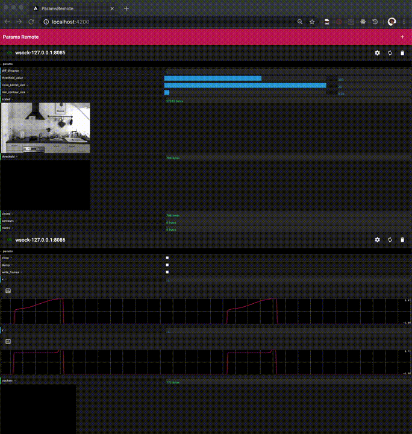

# ParamsRemote

[](https://travis-ci.org/github/markkorput/ParamsRemote)

_Angular/[dat.GUI](https://github.com/dataarts/dat.gui)-based frontend for realtime monitoring and controlling of remote applications._

Connects using websockets to [remote-params](https://github.com/markkorput/pyRemoteParams) servers.

## Try it out

Try it at: [http://shortnotion.com/apps/paramsremote/](http://shortnotion.com/apps/paramsremote/). This serverless frontend only supports connection through websockets. You will have to run your own param serving app (see [pyRemoteParams](https://github.com/markkorput/pyRemoteParams)).

## Compatibility

Currently works with these server-side implementations:
- [x] [pyRemoteParams](https://github.com/markkorput/pyRemoteParams) (python)

Support planned for:
- [ ] [Cinder](http://libcinder.org) ```params``` (C++)
- [ ] [OpenFrameworks](http://https://openframeworks.cc/) ```ofParameter``` (C++)

## Preview

[](docs/preview-1080p.gif)

## Roadmap

 * (Electron-based) desktop app
 * OSC support
 * Websockets/OSC server for Cinder params
 * Websockets/OSC server for OpenFrameworks parameters
